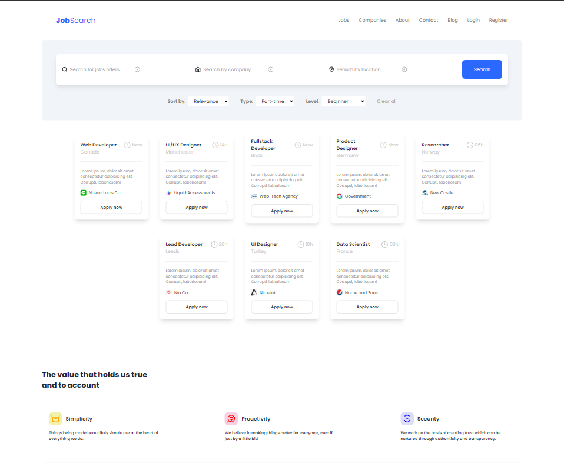

# ☕ | Job Search

Bem-vindo(a) ao repositório que contém a estrutura de um projeto baseado em uma aplicação de procura de empregos relacionados à tecnologia.

O objetivo desse projeto é estudar as ferramentas e tecnologias de desenvolvimento web mais utilizadas no mercado atualmente, sendo, neste caso, o [TailwindCSS](https://tailwindcss.com/).

> ⚠️ **É importante ressaltar que este projeto/repositório se encontra em constante atualização.**

Happy hacking!

## 🧠 Contexto



O projeto consiste em criar uma interface de procura de empregos relacionados às áreas da tecnologia, na qual foram utilizadas as seguintes ferramentas/tecnologias:

- [x] [Vite](https://vitejs.dev/)
- [x] [TypeScript](https://www.typescriptlang.org/)
- [x] [TailwindCSS](https://tailwindcss.com/)

## 🤝 Colaboradores

<table>
  <tr>
    <td align="center">
      <a href="https://github.com/galembeck" title="Pedro Galembeck">
        <br>
        <sub>
          <b>Pedro Galembeck</b>
        </sub>
      </a>
    </td>
  </tr>
</table>

## 📋 Instruções

Para visualizar o projeto acima, basta seguir as instruções abaixo.

- Utilize o [deploy](https://galembeck-job-search.vercel.app/) na vercel para abrir o link de visualização.
  > https://galembeck-job-search.vercel.app/

## 🖥️ Instalação

### Job Search

1. Clone este repositório:

```bash
git clone https://github.com/galembeck/job-search-app.git
```

1. Abra a pasta do projeto (_job-search-app_):

```bash
cd job-search-app
```

3. Instale as dependências utilizadas:

```bash
npm install
```

3. Inicie o projeto:

```bash
npm run dev
```

Made with 💜 by Pedro Galembeck.